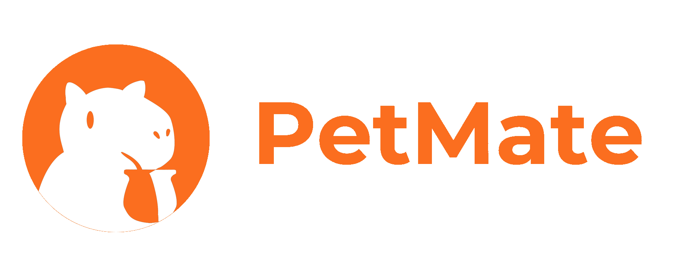
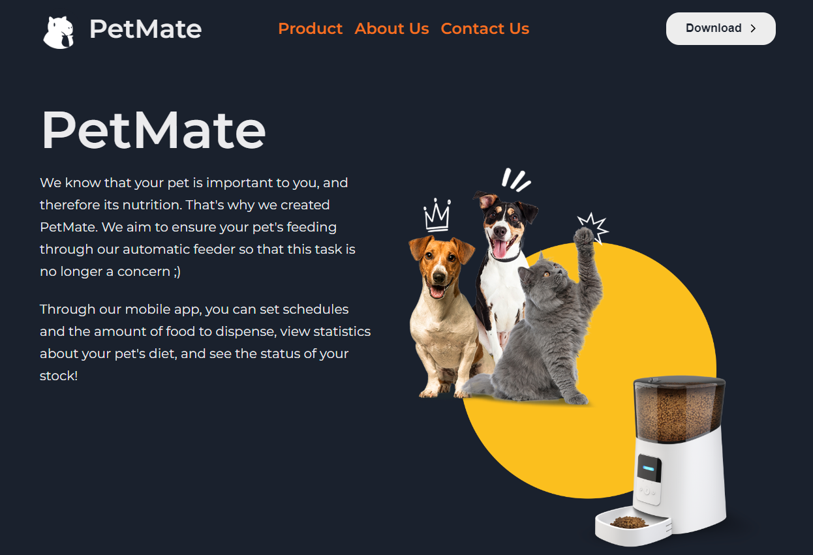

<h2 align="center">MPV Cohort #18 - Holberton School Uruguay</h2>

 We are a group of students from Holberton School Uruguay. For our MVP, we decided to create <strong>PetMate</strong>, an intelligent solution that automates the feeding of your pet. With PetMate, we aim to simplify and optimize this task mainly for pet owners who spend a large part of their time away from home.

Discover more about us in our <a href="http://www.petmate.tech/">PetMate</a> page :)

## Repository files
-  **index.html**: The main content of our landing page

- **main.js**: JavaScript file that apply dynamics to the landing page

- **css/style.css**: styles of the landing page

 

    </img>

## Host
<a href="https://cloud.google.com/?hl=en">
	</img>
</a>
<a href="https://get.tech/">
	</img>
</a>

 

## Front-end developers

<a href="https://www.linkedin.com/in/santiago-fern%C3%A1ndez-801641230/">Santiago Fernández</a>,
<a href="https://www.linkedin.com/in/mattobelen/">Belén Matto</a> &
<a href="https://www.linkedin.com/in/ignacio-castro347/">Ignacio Castro</a>

	<a></img></a>

Montevideo, Uruguay
